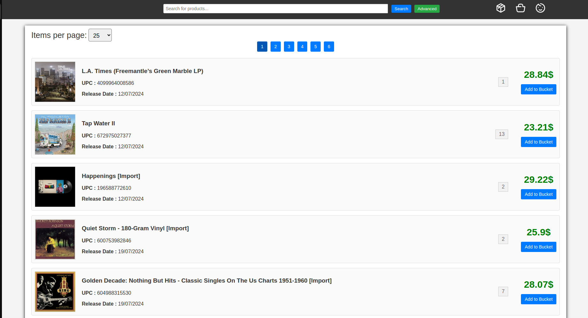

# VinylMarket 

[](https://www.docker.com/)
[](https://fastapi.tiangolo.com/)
[](https://www.postgresql.org/)
[](https://www.sqlalchemy.org/)
[](https://www.sqlalchemy.org/)

Сервис для продажи и покупки виниловых пластинок.





## 🚀 Основные возможности

### 💡 Базовый функционал

- **Поиск пластинок**:
  - Просмотр информации о пластинке и её продавце
  - Поиск по названию/артисту/жанру
  
- **Управление корзиной**:
  - Просмотр добавленных пластинок
  - Добавление/Удаление пластинок 

- **Управление заказами**:
  - Просмотр сделанных заказов
  - Создание заказа
  - Изменение статуса заказа в зависимости от роли

- **Возможности продавца**:
  - Создание/Изменение/Удаление объявлений
  - Просмотр купленных пластинок
  - Изменение статуса заказа


## 🛠 Технологический стек

### Backend
- **Framework**: FastAPI
- **Библиотеки**: sqlalchemy, pydantic, alembic, asyncpg, pyjwt

### Frontend
- **Библиотеки**: jinja2, html, css, javascript


## 🏗 Архитектура проекта

### 🧱 Сервисная структура
| Сервис                      | Назначение                          |
|-----------------------|-------------------------------------|
| **Auth Service**      | Создание аккаунта/Вход в аккаунт пользователя/продавца. Создание/Обновление/Удаление JWT токенов. |
| **Seller Service**  | Создание/Изменение/Удаление объявлений объявлений. Изменение статуса заказа.  |
| **User Service**   | Информация об аккаунте пользователя. Изменение карзины и списка заказов пользователя. |
| **Vinyl Records Service**      | Просмотр информации о пластинке. Поиск по названию/артисту/жанру. |
| **Frontend**              | Пользовательский интерфейс.         |

## 🚀 Быстрый старт

### Запуск проекта

```bash
git clone https://github.com/ResetPlease/Random-coffee-MAI-Tech.git
cd random-coffee
docker compose up -d
```